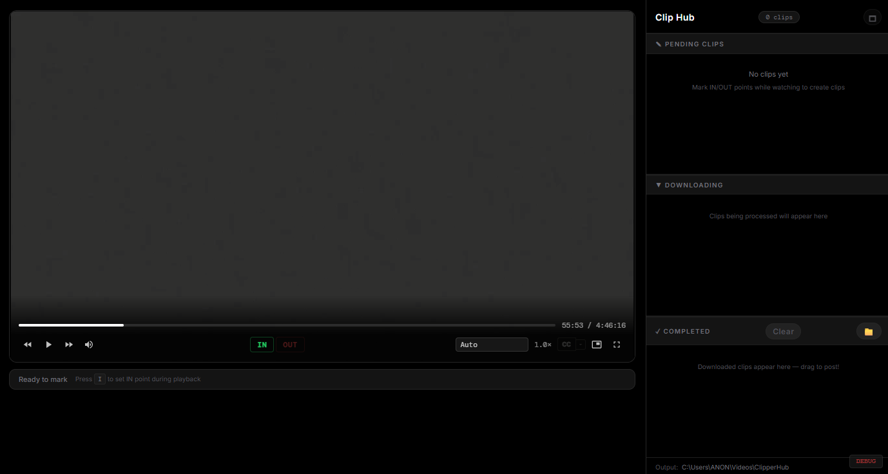

# ClippingHub

Desktop app for clipping Rumble streams and VODs. Navigate to your desired Channel or Paste a URL, set your in/out points, and export clips with optional watermarks and outros. Built on Electron + ffmpeg.



## Features

- HLS stream auto-detection from Rumble URLs
- Live and VOD clipping with catch-up playback
- Image watermarks, outros, and preview before export
- Detachable clip panel with resizable tabs
- Customizable keybinds and GPU acceleration (NVIDIA CUDA)

## Requirements

You need two things installed before running ClippingHub:

### Node.js

Download and install from [https://nodejs.org](https://nodejs.org/) — grab the LTS version. During install, keep the default options and make sure "Add to PATH" is checked. To verify it installed, open a terminal and run:

```
node --version
```

You should see something like `v20.x.x` or higher.

### ffmpeg

ffmpeg handles the actual video encoding. Download a build from [https://ffmpeg.org/download.html](https://ffmpeg.org/download.html) — on Windows, [gyan.dev](https://www.gyan.dev/ffmpeg/builds/) has prebuilt binaries. Grab the "essentials" zip, extract it somewhere (like `C:\ffmpeg`), and add the `bin` folder to your system PATH:

1. Search "Environment Variables" in Windows
2. Under System Variables, find `Path` and click Edit
3. Click New and add the path to the `bin` folder (e.g. `C:\ffmpeg\bin`)
4. Click OK and restart your terminal

Verify with:

```
ffmpeg -version
```

## Setup

Clone the repo and install dependencies:

```
git clone https://github.com/Coltinating/ClippingHub.git
cd ClippingHub
npm install
```

Then start the app:

```
npm start
```

Alternatively, on Windows you can just double-click `INSTALL.bat` instead of typing `npm install`, and `START.bat` instead of `npm start`.

## How to use it

1. The app opens with a built-in Rumble browser — browse channels, find streams, or paste any URL into the bar
2. You can set a default channel in the config menu so it loads automatically on startup
3. Once a video or live stream is playing, the HLS stream is detected and the player loads
4. Use the timeline controls to set your clip start and end points
5. Hit **Download** to export the clip to your Videos/ClippingHub folder

### Image watermarking

Click the watermark icon on a pending clip to overlay a custom image watermark. Control placement (corners or center), size, and opacity to brand your content without extra tools. Set a universal watermark in the config menu to apply it automatically to every clip.

### Image preview

Click **Preview** on a pending clip to see a snapshot of the output before downloading. Verify framing, watermark placement, and quality without committing to a full export.

### Outros

Click **Add Outro** on a pending clip to append a video to the end. Set a universal outro in the config menu so it gets added to every clip by default.

### Detachable clip panel

Pop the clip hub out into its own window so you can clip full-screen while keeping your queue visible. The panel syncs in real time with the main window.

### Catch-up mode

After making a clip during a live stream, you'll be behind real-time. Catch-up mode bumps the playback speed so you can get back to the live edge without missing anything.

### Config menu

The gear icon opens the settings panel where you can set a default channel, configure universal watermarks and outros, customize keybinds, enable GPU acceleration, and tweak encoding settings.

## Tech stack

- Electron
- HLS.js
- Express (local proxy)
- ffmpeg
